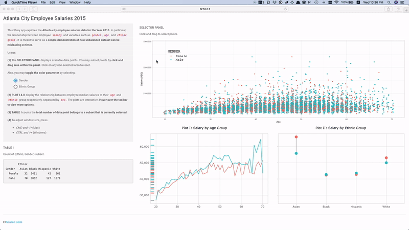
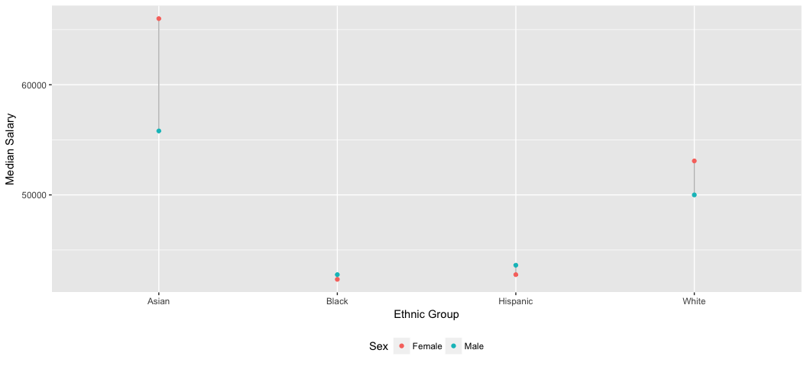
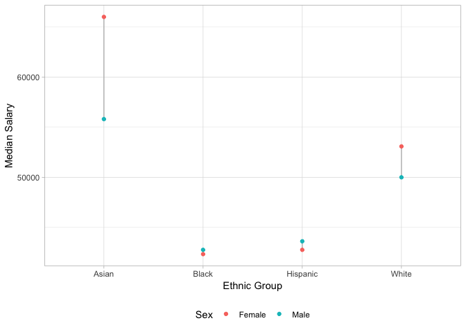

Atlanta City Employee Salaries 2015
================

Overview
--------

This [Shiny app](https://tmasjc.shinyapps.io/atl_salary_data/) explores the Atlanta city employee salaries data for the Year 2015. In particular, the relationship between employee `salary` and variables such as `gender`, `age`, and `ethnic group`.

Dataset obtained from [data.world](https://data.world/brentbrewington/atlanta-city-employee-salaries), contributed by [Brent Brewington](https://github.com/bbrewington/atlanta-salary-data).

Components
----------

-   **Selector Panel** which allows user to select points using cursor (click-and-drag)
-   **Plot I** displays the relationship of employee `median salary` by `age`, seperated by `gender`
-   **Plot II** displays the relationship of employee `median salary` by `ethnic group`, seperated by `gender`
-   **Table I** which tabulates count at each combination of `ethnic group` and `gender`



Motivation
----------

This Shiny app is meant as a simple demonstration of how unbalanced dataset can be misleading at times. In statistics, this phenomenon is known as **[Simpson's paradox](https://en.wikipedia.org/wiki/Simpson%27s_paradox)** or the Yule–Simpson effect.

If we look at male and female `median salary` at various `age group`, we might observe that *in general, male earns higher pay than female*.



However, if we look at male and female `median salary` by `ethnic groups`, we notice that female's median salary does not seem to lag behind. As a matter of fact, *both Asian and White women median salary is actually higher than men by an obvious margin*.



Tinker around the Shiny app to explore the data and understand the logic behind.

Deployment
----------

This Shiny app is shipped with Docker, built on [rocker/tidyverse](https://hub.docker.com/r/rocker/tidyverse/) image.

``` bash
# from this repo
git clone git@github.com:tmasjc/ATL_Salary_Data.git

cd ATL_Salary_Data

# name your image 
docker build -t atl_salary_data .
```
