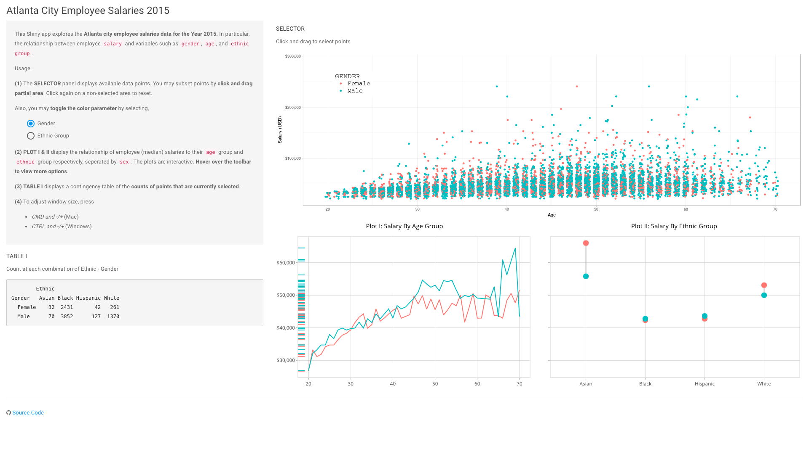
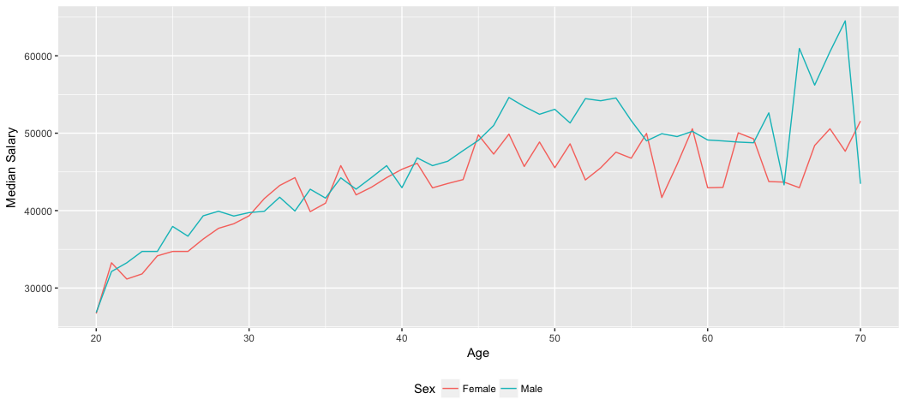

Atlanta City Employee Salaries 2015
================

### Overview

This [Shiny app](https://tmasjc.shinyapps.io/atl_salary_data/) explores the Atlanta city employee salaries data for the Year 2015. In particular, the relationship between employee `salary` and variables such as `gender`, `age`, and `ethnic group`.

Dataset obtained from [data.world](https://data.world/brentbrewington/atlanta-city-employee-salaries), contributed by [Brent Brewington](https://github.com/bbrewington/atlanta-salary-data).

The Shiny app consists of,

-   A ***Selector Panel*** which allows user to select points using cursor (click-and-drag)
-   ***Plot 1*** displays the relationship of employee `median salary` by `age group`, seperated by `gender`
-   ***Plot 2*** displays the relationship of employee `median salary` by `ethnic group`, seperated by `gender`
-   A ***Cross Table*** which tabulates count at each combination of `ethnic group` and `gender`

### Motivation

This Shiny app is meant as a simple exercise to demonstrate how unbalanced dataset can be misleading at times.

If we look at male and female `median salary` at various `age group`, we might observe that *in general, male earns higher pay than female*.

However, if we look at male and female `median salary` by `ethnic groups`, we notice that female's median salary does not seem to be lagging behind. *For Asian and White women, their median salary is actually higher than men by an obvious margin*.

Tinker around the Shiny app to find out why is that so.
